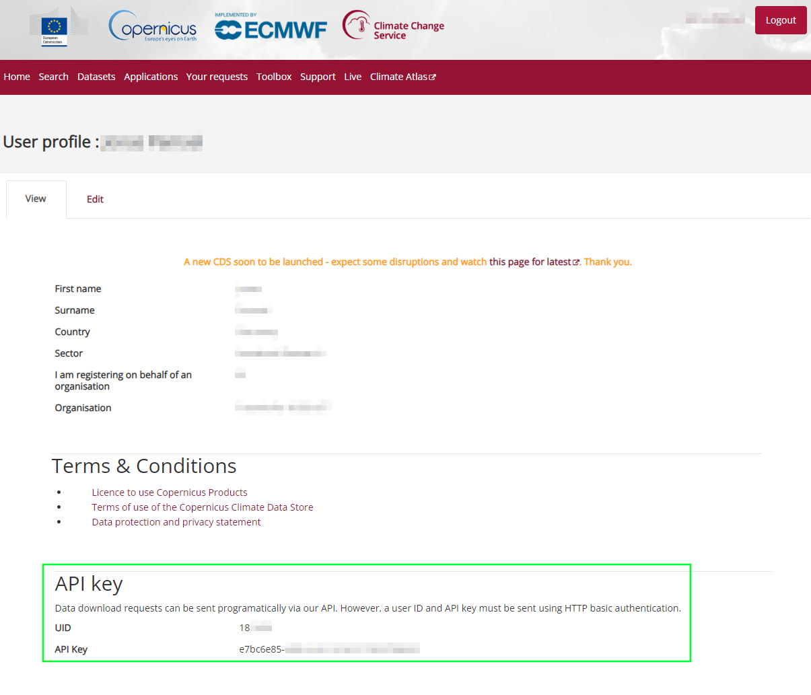

# Using Eclipse WattAdvisor

## 1 Installation

Make sure you run the listed commands from a project directory, e.g. *WattAdvisor/* which should at least contain these sub-directories and files:

```text
├── WattAdvisor/
│   ├── wattadvisor/...
│   ├── environment.yaml
```

### 1.1 Set up the python environment via conda

To create the required python environment containing all essential packages, you can use *conda*.
In this way, common OS such as *Windows*, *Linux* and *Mac OS* are supported.

#### 1.1.1 Install Anaconda or Miniconda 

To use *conda* you have to install **Anaconda** or **Miniconda**. Take a look at their documentations to find installation instructions for your OS:

- [Anaconda Installation](https://docs.anaconda.com/free/anaconda/install/)
- [Miniconda Installation](https://docs.conda.io/projects/miniconda/en/latest/miniconda-install.html)

Remember to [configure conda to use your company proxy connection](https://docs.anaconda.com/free/anaconda/configurations/proxy/) if existing.

#### 1.1.2 Create the conda environment

Use the provided `environment.yaml` file to create a new conda environment including all necessary third-party python libraries:

```shell
conda env create -f environment.yaml
``` 

### 1.2 Install or add a solver to the project

An optimization problem solver is required to use WattAdvisor. The conda environment of WattAdvisor already contains the solver *HiGHS*.
Furthermore, *CBC* solver is currently supported directly, but needs to be installed separately.

### 1.2.1 Installation of CBC solver under Linux or Mac OS

If you are using Linux or Mac OS, you can use conda to install *CBC* solver to the WattAdvisor environment:

```shell
conda activate wattadvisor
conda install conda-forge::coincbc
``` 

### 1.2.2 Installation of CBC solver under Windows

Under Windows, you have to download a pre-compiled executable of *CBC* solver and place it into the WattAdvisor project directory.

Download the latest Windows release as a ZIP archive (choose the file ending with "x86_64-w64-mingw64.zip") from the [CBC Github Repository](https://github.com/coin-or/Cbc/releases/latest).

Extract the "cbc.exe" file and place it into the following directory: */WattAdvisor/wattadvisor/optimization_model/*

### 1.3 Add weather data

WattAdvisor depends on weather data to estimate the power generation profile from renewable energy plants or to generate synthetical heat demand profiles from annual sums of heat demands. You have to manually download weather data from Copernicus Climate Change Service and place it into the data directory.

### 1.3.1 Download weather data from Copernicus Climate Change Service

To download weather data from Copernicus Climate Change Service, you have to [create an account.](https://cds.climate.copernicus.eu/user/register)
After creation, visit your [account page](https://cds.climate.copernicus.eu/user) to collect your API key and UID which is needed to download weather data. You find the key and UID at the bottom of the page: 


After that, copy the following code snippet to a new Python script:

```python

import cdsapi

# paste your uid here:
uid = 
# paste your API key here:
key = 

c = cdsapi.Client(key=f"{uid}:{key}", url="https://cds.climate.copernicus.eu/api/v2")

c.retrieve(
    'reanalysis-era5-single-levels',
    {
        'product_type': 'reanalysis',
        'variable': [
            '100m_u_component_of_wind', '100m_v_component_of_wind', '10m_u_component_of_wind',
            '10m_v_component_of_wind', '2m_temperature', 'forecast_surface_roughness',
            'soil_temperature_level_4', 'surface_pressure', 'surface_solar_radiation_downwards',
            'total_sky_direct_solar_radiation_at_surface',
        ],
        'year': '2022',
        'month': [
            '01', '02', '03',
            '04', '05', '06',
            '07', '08', '09',
            '10', '11', '12',
        ],
        'day': [
            '01', '02', '03',
            '04', '05', '06',
            '07', '08', '09',
            '10', '11', '12',
            '13', '14', '15',
            '16', '17', '18',
            '19', '20', '21',
            '22', '23', '24',
            '25', '26', '27',
            '28', '29', '30',
            '31',
        ],
        'time': [
            '00:00', '01:00', '02:00',
            '03:00', '04:00', '05:00',
            '06:00', '07:00', '08:00',
            '09:00', '10:00', '11:00',
            '12:00', '13:00', '14:00',
            '15:00', '16:00', '17:00',
            '18:00', '19:00', '20:00',
            '21:00', '22:00', '23:00',
        ],
        'format': 'netcdf',
    },
    'weather.nc')
```

Paste your Climate Data Store UID and API key at the corresponding position and run the script from the wattadvisor conda environment. If everything is configured correctly, you will get a similar output like:
```bash
2024-06-07 13:44:26,667 INFO Welcome to the CDS
2024-06-07 13:44:26,667 INFO Sending request to https://cds.climate.copernicus.eu/api/v2/resources/reanalysis-era5-single-levels
2024-06-07 13:44:26,776 INFO Request is queued
2024-06-07 13:44:27,865 INFO Request is running
2024-06-07 13:46:20,994 INFO Request is completed
2024-06-07 13:46:20,994 INFO Downloading https://download-0015-clone.copernicus-climate.eu/cache-compute-0015/cache/data5/adaptor.mars.internal-1717760725.....nc to weather.nc (1.4G)  
```

After the download has completed, move the downloaded *weather.nc*-file to the following directory: */WattAdvisor/wattadvisor/optimization_model/data*
Installation of WattAdvisor is now completed.

## 2 Defining an input request

To create a new input request, use the prepared data model. Be careful to run these commands inside the newly created conda environment

```python
from wattadvisor.data_models.input_model import InputModel
from wattadvisor.data_models.input_model_location import InputModelLocation
from wattadvisor.data_models.input_model_demand_object import InputModelDemandObject
from wattadvisor.data_models.input_model_energy_tariffs import InputModelEnergyTariffs
from wattadvisor.data_models.input_model_component_object import InputModelComponentPower
from wattadvisor.data_models.input_model_single_tariff_object import InputModelSingleTariffObject
from wattadvisor.data_models.input_model_single_tariff_energy_object import InputModelSingleTariffEnergyObject
from wattadvisor.data_models.enums import EnergyType, Resolution, EnergyUnit, PowerUnitComponent, EnergyPriceUnit

location = InputModelLocation(
    longitude=10,
    latitude=50
)

energy_demands = [
    InputModelDemandObject(
        demand_values = [10000],
        resolution=Resolution.R1Y,
        unit=EnergyUnit.KWH,
        energy_type=EnergyType.ELECTRICAL
    )
]

energy_components = [
    InputModelComponentPower(
        component_type=PowerUnitComponent.PHOTOVOLTAIK_ROOF,
        installed_power=10,
        potential_power=20
    )
]

electrical_energy_purchase = InputModelSingleTariffObject(
    energy=InputModelSingleTariffEnergyObject(
        price_values=[0.35],
        resolution=Resolution.R1Y,
        unit=EnergyPriceUnit.EUR_PER_KWH
    )
)

energy_tariffs = InputModelEnergyTariffs(
    electrical_energy_purchase=electrical_energy_purchase
)

new_input = InputModel(
    location=location,
    energy_demands=energy_demands,
    energy_components=energy_components,
    energy_tariffs=energy_tariffs
)
```

This defines the following scenario:
- annual sum of electrical energy demand of 10.000 kWh
- existing photovoltaic system on the roof with 10 kWp
- potential for an additional 10 kWp of photovoltaic modules
- electrical energy can be purchased from the grid with a static price of 35 cents per kWh

## 3 Running the optimization

By running the optimization, recommendations to the following questions can be expected:
- Should more photovoltaic modules be added to the roof system to exceed the cost minimum?
    - If yes: How much modules expressed in kWp should be added?
    - What are the resulting investment cost for the photovoltaic modules?
- How much electrical energy is still required to purchased from the electrical grid to fulfill the electrical demands?
-   Which annual cost can be expected for electrical energy purchase from the grid?

Use :py:module:`wattadvisor.optimization_model.process_runner` to initiate a new optimization with the created input:

```python
from wattadvisor.optimization_model import process_runner

# use 'export=True' to create an Excel file of detailed results and time series to inspect  
results = process_runner.run_direct(new_input, export=True)
```

The variable `results` contains the optimization results.
After a short wait, there should also be a new Excel file at the project directory containing the results.

## 4 Understanding the results

Let's inspect the variable `results`. It is a data model which can be accessed to retrieve the optimal values of our scenario:

```python
from pprint import pprint

pprint(results.dict())
```

<details>
<summary>This prints out the following:</summary>

```python
{'requested_input': {'energy_components': [{'capex': None,
                                            'component_type': <PowerUnitComponent.PHOTOVOLTAIK_ROOF: 'PHOTOVOLTAIK_ROOF'>,
                                            'installed_power': 5.0,
                                            'lifespan': None,
                                            'opex': None,
                                            'potential_power': 10.0}],
                     'energy_demands': [{'demand_values': [10000.0],
                                         'energy_type': <EnergyType.ELECTRICAL: 'ELECTRICAL'>,
                                         'resolution': <Resolution.R1Y: '1Y'>,
                                         'unit': <EnergyUnit.KWH: 'KWH'>}],
                     'energy_tariffs': {'electrical_energy_feedin': {'energy': {'price_values': [0.0],
                                                                                'resolution': <Resolution.R1Y: '1Y'>,
                                                                                'unit': <EnergyPriceUnit.EUR_PER_KWH: 'EUR_PER_KWH'>},
                                                                     'power': None},
                                        'electrical_energy_purchase': {'energy': {'price_values': [0.35],
                                                                                  'resolution': <Resolution.R1Y: '1Y'>,
                                                                                  'unit': <EnergyPriceUnit.EUR_PER_KWH: 'EUR_PER_KWH'>},
                                                                       'power': None},
                                        'natural_gas_purchase': None,
                                        'thermal_energy_purchase': None},
                     'interest_rate': 0.05,
                     'location': {'latitude': 50.0, 'longitude': 10.0}},
 'results': {'current_scenario': {'components': [{'annuity': 351.5678815510371,
                                                  'component_type': <PowerUnitComponent.PHOTOVOLTAIK_ROOF: 'PHOTOVOLTAIK_ROOF'>,
                                                  'installed_power': 5.0,
                                                  'investment_cost': 3750.0,
                                                  'operational_cost': 107.625,
                                                  'produced_energy': [{'amount': 5987.854562366385,
                                                                       'energy_type': <EnergyType.ELECTRICAL: 'ELECTRICAL'>}]},
                                                 {'annuity': 2007.7232143177137,
                                                  'component_type': <PurchaseComponent.ELECTRICAL_ENERGY_PURCHASE: 'ELECTRICAL_ENERGY_PURCHASE'>,
                                                  'produced_energy': [{'amount': 5736.352040907731,
                                                                       'energy_type': <EnergyType.ELECTRICAL: 'ELECTRICAL'>}],
                                                  'purchase_cost': 2007.7232143177137},
                                                 {'annuity': -0.0,
                                                  'component_type': <FeedinComponent.ELECTRICAL_ENERGY_FEEDIN: 'ELECTRICAL_ENERGY_FEEDIN'>,
                                                  'produced_energy': [{'amount': -1724.2066032741272,
                                                                       'energy_type': <EnergyType.ELECTRICAL: 'ELECTRICAL'>}],
                                                  'purchase_cost': -0.0}],
                                  'kpis': {'total_annuities': 2359.2910958687507,
                                           'total_income': -0.0,
                                           'total_investment_cost': 3750.0,
                                           'total_operational_cost': 107.625,
                                           'total_purchase_cost': 2007.7232143177137}},
             'target_scenario': {'components': [{'annuity': 427.88506844356255,
                                                 'component_type': <PowerUnitComponent.PHOTOVOLTAIK_ROOF: 'PHOTOVOLTAIK_ROOF'>,
                                                 'installed_power': 6.085383376829411,
                                                 'investment_cost': 4564.037532622058,
                                                 'operational_cost': 130.98787718625306,
                                                 'produced_energy': [{'amount': 7287.6781233393185,
                                                                      'energy_type': <EnergyType.ELECTRICAL: 'ELECTRICAL'>}]},
                                                {'annuity': 1914.447492981199,
                                                 'component_type': <PurchaseComponent.ELECTRICAL_ENERGY_PURCHASE: 'ELECTRICAL_ENERGY_PURCHASE'>,
                                                 'produced_energy': [{'amount': 5469.84997994623,
                                                                      'energy_type': <EnergyType.ELECTRICAL: 'ELECTRICAL'>}],
                                                 'purchase_cost': 1914.447492981199},
                                                {'annuity': -0.0,
                                                 'component_type': <FeedinComponent.ELECTRICAL_ENERGY_FEEDIN: 'ELECTRICAL_ENERGY_FEEDIN'>,
                                                 'produced_energy': [{'amount': -2757.528103285579,
                                                                      'energy_type': <EnergyType.ELECTRICAL: 'ELECTRICAL'>}],
                                                 'purchase_cost': -0.0}],
                                 'kpis': {'total_annuities': 2342.3325614247615,
                                          'total_income': -0.0,
                                          'total_investment_cost': 4564.037532622058,
                                          'total_operational_cost': 130.98787718625306,
                                          'total_purchase_cost': 1914.447492981199}}},
 'status': {'error_message': None,
            'status': <OptimizationStatus.SUCCESS: 'SUCCESS'>}}

```
</details>
<br>
You can also access single values from this big result object. For example, if you just want to know the cost-minimum amount of photovoltaic modules for the scenario, do this:

```python
pprint(results.results.target_scenario.components)
```
```python
[OptimizationResultsComponentObjectPower(component_type=<PowerUnitComponent.PHOTOVOLTAIK_ROOF: 'PHOTOVOLTAIK_ROOF'>, installed_power=6.085383376829411, investment_cost=4564.037532622058, operational_cost=130.98787718625306, annuity=427.88506844356255, produced_energy=[OptimizationResultsComponentEnergyProductionObject(energy_type=<EnergyType.ELECTRICAL: 'ELECTRICAL'>, amount=7287.6781233393185)]),
 OptimizationResultsComponentObjectPurchaseFeedin(component_type=<PurchaseComponent.ELECTRICAL_ENERGY_PURCHASE: 'ELECTRICAL_ENERGY_PURCHASE'>, purchase_cost=1914.447492981199, annuity=1914.447492981199, produced_energy=[OptimizationResultsComponentEnergyProductionObject(energy_type=<EnergyType.ELECTRICAL: 'ELECTRICAL'>, amount=5469.84997994623)]),
 OptimizationResultsComponentObjectPurchaseFeedin(component_type=<FeedinComponent.ELECTRICAL_ENERGY_FEEDIN: 'ELECTRICAL_ENERGY_FEEDIN'>, purchase_cost=-0.0, annuity=-0.0, produced_energy=[OptimizationResultsComponentEnergyProductionObject(energy_type=<EnergyType.ELECTRICAL: 'ELECTRICAL'>, amount=-2757.528103285579)])]
```

Now, the installed power (including the already installed power of 5 kW) for the photovoltaic component is accessible at list index 0:

```python
results.results.target_scenario.components[0].installed_power
```

```python
6.085383376829411
```

To conclude, it seems as the cost-minimum to add around 1.08 kWp of photovoltaic modules to the existing amount of 5 kWp.